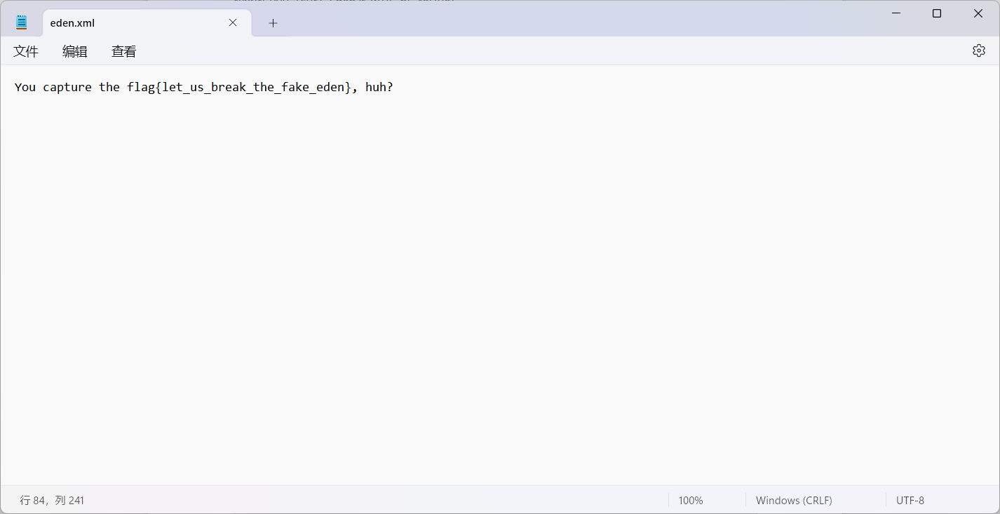
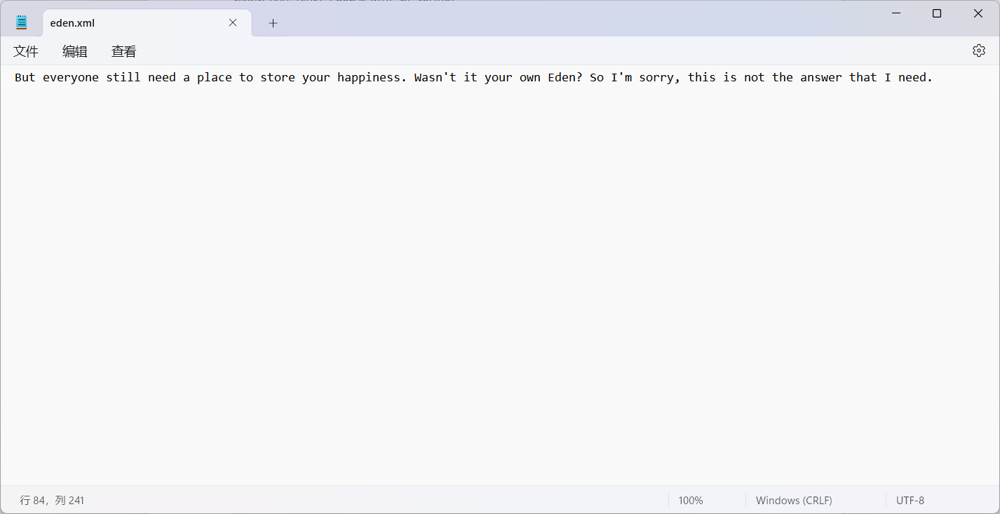
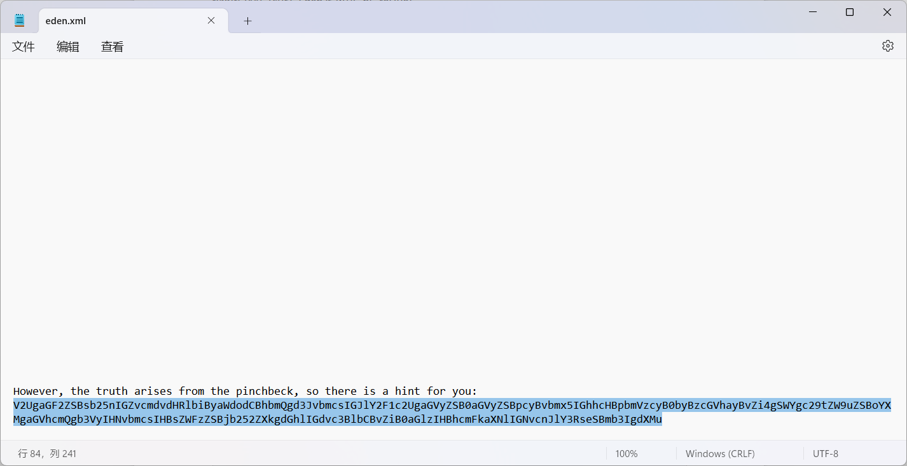

# 第五条古则

> 这么多人做出来啊，恭喜此题成为最丢人的困难题。

首先打开文档，会发现这个文档里面有一些玄学的话语。 

不管它们，最后一句话很重要：**也许上帝早就在这上面留下了来自乐园的指引呢？**

然而以正常视角查看会发现没有东西，说明本题一定考查了**文件隐写**。 

尝试将文件内容全选，会发现第一行出现了异常多的空白。

接下来考虑将这部分复制到记事本上。你会发现隐藏起来的一段废话文学：

> 我可怜的迷途羔羊啊，我无法用现在的方式拯救你，但我已经尽我所能留下了痕迹，它将在很久以 后被人察觉并破译出来。这个时间非常特别，他既不是1000年，也不是2000年，甚至他都并不是 个能够被10整除的年份，它就是2023年。但也正因它很普通，他才能被人所铭记。

这段话告诉你这个文档有隐写，这就够了，将所有的文本加入到记事本中，你会发现额外多出来好几处乱码……

将三段拼起来，然后我们得到一串看上去很像base64编码的东西。然而**请注意文本中的“凯撒”**，直接 base64解码是会报错的，你得找出那个用于加密偏移量才能够正确解码。开始爆破，你会得到偏移量为5（废话，**第五条古则**）。将其解码即可得到一串flag：

flag{fI_y0u_TsurT_Eden,lt_w1iL_bE_teHRe} 

随便输入，反正不对。为什么？**要是真就这样做出来了，我的第一条提示就没有意义了。**

现在返回来查看第一条提示：啊哈哈，和你这个神棍的传教游戏，还挺愉快的呢。**（纸撕碎的声音）**

> 以下为百度百科上对.docx的解释： 
>
> docx是微软Word的格式，在Microsoft Office2007之后版本使用，其基于Office Open XML标准的**压缩**取代了其以前专有的默认文件格式，在传统的文件名扩展名后面添加了字母“x”。任何能够打开 DOC文件的文字处理软件都可以将该文档转换为DOCX文件，docx文件比doc文件所占用的空间更小，docx格式的文件本质上是一个XML文件。

看得出来，要想将纸撕碎，我们需要将其**解压**。将其后缀改为zip解压后发现了一个名为**eden.xml**的文件，打开它。

看文档要看完啊……我在后台看到不少人交了那个flag{let_us_break_the_fake_eden}。

最后又是一条被base64编码的提示，得到明文为：

> We have long forgotten right and wrong, because here there is only happiness to speak of. If someone has heard our song, please convey the gospel of this paradise correctly for us.

翻译过来就是：

> 我们早已忘却对错，皆因此地唯有快乐可言说。若歌声为人耳闻，望其为吾等纠正福音。

说人话就是给flag纠错，让它变成一条通顺的话语。

flag{let_us_break_the_fake_eden}已经通过文件石锤了是假flag，而且也没有语法问题，忽略它。

将之前得到的flag{fI_y0u_TsurT_Eden,lt_w1iL_bE_teHRe}进行**纠错处理**，并且根据最初得到的提示**”明文均为小写“**，更改出最后的正确答案：

**flag{if_you_trust_eden,it_will_be_there}**

此题终结。